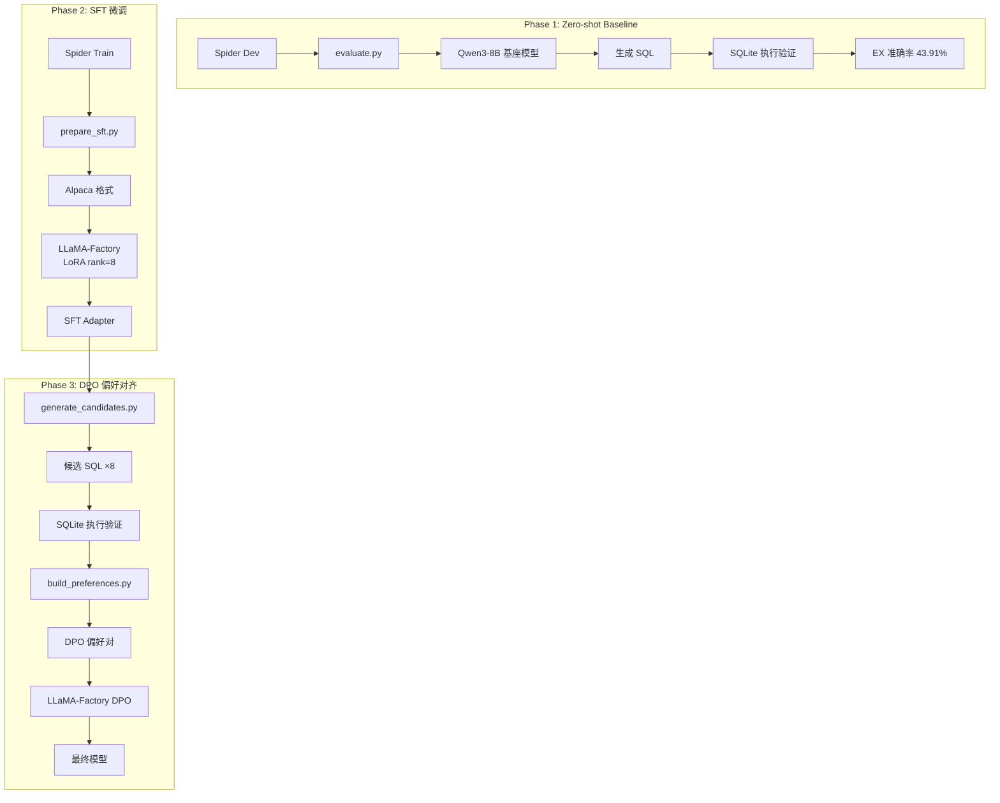

# AlignSQL：Qwen3-8B 的 NL2SQL 全流程微调

> 从 SFT 到 DPO，完整跑通 NL2SQL 的模型对齐实践。
>
> 基座模型：Qwen3-8B | 数据集：Spider | 框架：LLaMA-Factory | 硬件：RTX 4090 (24GB)

---

## 一、项目概述

### 1.1 项目目标

以 NL2SQL（自然语言转 SQL）为切入点，完整跑通大语言模型微调的全流程。NL2SQL 是企业级 DataAgent（如阿里 DataWorks 智能问数、腾讯 TCDataAgent、蚂蚁 Agentar-Scale-SQL）的核心底层能力，目标是让业务人员直接用自然语言查询数据，无需依赖技术人员写 SQL。

- **SFT（监督微调）**：让 Qwen3-8B 学会根据自然语言问题和数据库 schema 生成正确的 SQL
- **DPO（偏好对齐）**：通过执行反馈自动构建偏好对，让模型从"能做对"到"能做好"

当前基于 Spider 学术数据集完成方法验证，后续计划引入中文业务数据集（天池 NL2SQL）和企业级 Schema 规模（Spider 2.0）进行泛化测试，向真实业务场景靠近。

### 1.2 为什么选 NL2SQL

| 原因 | 说明 |
|------|------|
| 任务定义清晰 | 输入 = 问题 + schema，输出 = SQL，评价指标明确（执行准确率） |
| 数据易获取 | Spider / BIRD 等公开数据集成熟，不需要自己采集 |
| 适合展示 DPO 效果 | SQL 的可执行性天然适合自动构建偏好对，无需人工标注 |
| 业务价值显性 | 直接对应大厂 ChatBI / DataAgent 场景的核心技术需求 |

---

## 二、技术方案

### 2.1 整体架构



### 2.2 关键设计决策

| 决策 | 选择 | 理由 |
|------|------|------|
| 基座模型 | **Qwen3-8B** | 2025年4月发布，中英文强，8B 参数量在 4090 上可 LoRA 训练 |
| 微调框架 | **LLaMA-Factory** | 统一支持 SFT + DPO + LoRA，配置驱动，不需要手写训练循环 |
| 实验追踪 | **Weights & Biases (wandb)** | 实时监控训练曲线，对比不同超参数的实验效果 |
| 微调方式 | **LoRA (rank=8)** | 单卡 24GB 显存的选择，rank=8 平衡效果与资源 |
| 数据集 | **Spider** | 标准 NL2SQL 基准，7000+ 训练样本，评估体系成熟 |
| 偏好构建 | **执行反馈自动构建** | 无需人工标注，SQL 的可执行性天然适合自动化 |
| 评估指标 | **Execution Accuracy (EX)** | 结果集一致即正确，比 Exact Match 更合理 |

### 2.3 数据集：Spider 详解

| 项目 | 数据 |
|------|------|
| 训练集 | 7,000 个 question-SQL 对，146 个数据库 |
| 开发集 | 1,034 个 question-SQL 对 |
| 测试集 | 2,147 个 question-SQL 对（隐藏 label） |
| 领域 | 138 个不同领域（跨域，训练和测试的数据库不重叠） |
| SQL 复杂度 | 4 级：Easy / Medium / Hard / Extra Hard |

**为什么选 Spider 而不是 BIRD：**
- Spider 的数据量适中（7K），迭代速度快。BIRD 有 12K 样本但数据库总大小 33GB，光数据准备就耗时
- Spider 是跨域设定（cross-domain），更考验模型的泛化能力
- 先用 Spider 跑通全流程，有余力再迁移到 BIRD

---

## 三、Phase 1：数据准备

### 3.1 数据格式转换

Spider 原始格式：

```json
{
  "db_id": "department_management",
  "question": "How many heads of departments are older than 56?",
  "query": "SELECT count(*) FROM head WHERE age > 56"
}
```

需要转换为 LLaMA-Factory 标准 Alpaca 格式：

```json
{
  "instruction": "根据数据库 schema 生成 SQL 查询语句。\n数据库：department_management\n表 head：head_id, name, born_state, age\n表 management：department_id, department_name, head_id, management_id",
  "input": "How many heads of departments are older than 56?",
  "output": "SELECT count(*) FROM head WHERE age > 56"
}
```

### 3.2 Schema 序列化

这是影响效果的关键细节。Schema 序列化方式参考 DAIL-SQL 的设计：

```python
def serialize_schema(db_info):
    """将数据库 schema 序列化为自然语言描述"""
    lines = [f"数据库：{db_info['db_id']}"]
    for table in db_info['tables']:
        cols = ', '.join([f"{c['name']} ({c['type']})" for c in table['columns']])
        lines.append(f"表 {table['name']}：{cols}")
        if table['foreign_keys']:
            fks = ', '.join(table['foreign_keys'])
            lines.append(f"  外键：{fks}")
    return '\n'.join(lines)
```

**考虑过的方案及选择理由：**

| 方案 | 效果 | 选择？ |
|------|------|--------|
| 纯列名列表 | 简单但缺少类型信息 | ❌ |
| 列名 + 类型 + 外键 | 信息最完整 | ✅ 选用 |
| 增加示例值 | 理论上有帮助但增加 token 消耗 | ❌ 受限于上下文长度 |

### 3.3 数据过滤

Spider 训练集里部分 SQL 在 SQLite 中执行不通过（建表语句不兼容等），需要做清洗：

```python
def validate_data(question, sql, db_path):
    """验证 SQL 是否可在对应数据库上执行"""
    try:
        conn = sqlite3.connect(db_path)
        conn.execute(sql).fetchall()
        conn.close()
        return True
    except Exception:
        return False
```

经清洗后预计保留约 6,500 条有效样本（从 7,000 条过滤约 500 条）。

---

## 四、Phase 2：SFT 训练

### 4.1 训练配置

```yaml
# LLaMA-Factory config yaml
model_name_or_path: Qwen/Qwen3-8B
dataset: spider_train
template: qwen
stage: sft
finetuning_type: lora
lora_target: q_proj,k_proj,v_proj,o_proj
lora_rank: 8
lora_alpha: 64
lora_dropout: 0.05

learning_rate: 2e-4
per_device_train_batch_size: 4
gradient_accumulation_steps: 8
num_train_epochs: 3

output_dir: models/alignsql-sft
logging_steps: 10
save_steps: 500

# wandb 实验追踪
report_to: wandb
wandb_project: alignsql
wandb_run_name: sft_lora32_lr2e4
```

### 4.2 LoRA 原理与本项目的适配

LoRA（Low-Rank Adaptation）的核心思想：冻结预训练权重，在 Transformer 的注意力层参数旁插入低秩矩阵进行训练。

```
原始: h = Wx          (W 冻结，不更新)
LoRA: h = Wx + BAx    (B, A 可训练，r << d)
```

- **rank=8**：适中秩，7B 模型在 24GB 显存下的选择
- **target_modules = attention 全连接**：覆盖影响力最大的参数（q/k/v/o），projection 层不改以减少参数量

**训练开销估算：**

| 项目 | 数值 |
|------|------|
| 可训练参数量 | ~160M（全量 8B 的 2%） |
| 每步显存 | ~18-20 GB |
| 训练时间 | ~3-4 小时（3 epoch, 4090）|
| 输出模型大小 | ~320 MB（LoRA adapter 权重）|

### 4.3 实验结果

| 指标 | 预期值 | 实际值 | 说明 |
|------|--------|--------|------|
| 训练集 loss | ~0.3-0.5 | 待记录 | - |
| 开发集执行准确率 | ~75-80% | **71.86%** | 接近预期 |
| 生成 SQL 语法合格率 | >95% | 待记录 | - |

#### Zero-shot vs SFT 对比

| 难度 | Zero-shot EX | SFT EX | 提升 |
|------|-------------|--------|------|
| easy | 72.18% | 87.90% | +15.72% |
| medium | 45.96% | 72.87% | +26.91% |
| hard | 25.86% | 67.82% | +41.96% |
| extra | 15.06% | 49.40% | +34.34% |
| **all** | **43.91%** | **71.86%** | **+27.95%** |

#### 实验结论

1. **SFT 微调效果显著**：相比 zero-shot baseline，SFT 在所有难度级别上都带来了显著提升
2. **难度越高提升越大**：hard 和 extra 级别的提升最为明显，说明微调对复杂 SQL 生成帮助更大
3. **easy 级别仍有提升空间**：87.90% 的执行准确率意味着仍有约 12% 的简单查询失败，需进一步优化

---

## 五、Phase 3：DPO 偏好对齐

### 5.1 为什么 DPO

传统 RLHF 需要训练奖励模型 + PPO 优化，工程复杂度高。DPO 直接使用偏好对优化策略：

```
DPO 优势：不需要奖励模型、不需要 PPO 的 on-policy 采样、训练稳定性好
```

**DPO vs PPO 对比：**

| 维度 | DPO | PPO |
|------|-----|-----|
| 奖励模型 | 不需要 | 需要单独训练 RM |
| 训练复杂度 | 低（两轮 loss 计算） | 高（Actor + Critic + Reward） |
| 显存占用 | ~SFT 的 1.5x | ~SFT 的 3x |
| 超参敏感度 | 低 | 高（KL penalty, clip range 等）|
| 可复现性 | 高 | 中等 |

在本项目场景下，DPO 是最经济的选择——可以用一张 4090 完成。

### 5.2 偏好对自动构建

**核心流程：**

```
对每条训练数据 (question, schema, gold_sql):
  1. SFT 模型生成 8 条候选 SQL（beam search, temperature=0.8）
  2. 在 SQLite 上逐条执行
  3. 根据执行结果构建偏好对
```

**候选生成策略：**

```python
def generate_candidates(model, question, schema, n=8):
    """生成多条候选 SQL，增加多样性"""
    candidates = []
    # 策略 1：beam search（高概率路径）
    outputs = model.generate(
        prompt, 
        num_beams=4, 
        num_return_sequences=4,
        max_new_tokens=256
    )
    candidates.extend(outputs)
    
    # 策略 2：采样（增加多样性）
    outputs = model.generate(
        prompt,
        do_sample=True,
        temperature=0.8,
        top_p=0.9,
        num_return_sequences=4,
        max_new_tokens=256
    )
    candidates.extend(outputs)
    return candidates
```

**偏好对构建逻辑（关键细节）：**

```python
def build_preference_pair(candidates, db_path, question, gold_sql):
    """根据执行结果构建偏好对"""
    results = []
    for cand in candidates:
        success, result_set, error_type = execute_sql(cand, db_path)
        results.append({
            'sql': cand,
            'success': success,
            'result_set': result_set,
            'error_type': error_type
        })
    
    successful = [r for r in results if r['success']]
    failed = [r for r in results if not r['success']]
    
    # 规则 1：有成功有失败 → chosen=成功，rejected=失败（最清晰的情况）
    if successful and failed:
        chosen = random.choice(successful)
        rejected = random.choice(failed)
    
    # 规则 2：全部成功 → 按执行结果去重，选不同的作为偏好对
    elif len(successful) >= 2:
        # 按结果集去重
        unique_results = {}
        for r in successful:
            key = str(r['result_set'])
            unique_results.setdefault(key, []).append(r)
        
        if len(unique_results) >= 2:
            # 不同结果集的 SQL，选执行时间短的为 chosen
            groups = list(unique_results.values())
            chosen = min(groups[0], key=lambda x: x.get('time', 0))
            rejected = min(groups[1], key=lambda x: x.get('time', 0))
        else:
            # 结果集全部相同，跳过（语义等价，不构成有效偏好）
            return None
    
    # 规则 3：全部失败 → 按错误类型区分偏好
    else:
        # 语法错误 > 执行超时 > 空结果
        error_priority = {'syntax': 0, 'timeout': 1, 'empty': 2}
        sorted_failed = sorted(failed, key=lambda x: error_priority.get(x['error_type'], 0))
        if error_priority.get(sorted_failed[0]['error_type'], 0) != \
           error_priority.get(sorted_failed[-1]['error_type'], 0):
            chosen = sorted_failed[-1]   # 错误更轻微的
            rejected = sorted_failed[0]  # 错误更严重的
        else:
            return None  # 错误类型相同，跳过
    
    return {
        'chosen': chosen['sql'],
        'chosen_trace': chosen.get('trace', ''),
        'rejected': rejected['sql'],
        'rejected_trace': rejected.get('trace', '')
    }
```

**为什么"全部成功但结果集相同"要跳过：** 两条 SQL 结果集一致但写法不同，不代表其中一条更好。如果拿来做 DPO，模型会学到不必要的风格偏好，反而损害泛化能力。

### 5.3 DPO 训练配置

```yaml
# LLaMA-Factory config yaml
model_name_or_path: models/alignsql-sft
dataset: dpo_preferences
stage: dpo
finetuning_type: lora
lora_target: q_proj,k_proj,v_proj,o_proj
lora_rank: 8

dpo_beta: 0.3
learning_rate: 5e-6
per_device_train_batch_size: 4
num_train_epochs: 2

output_dir: models/alignsql-dpo

# wandb 实验追踪
report_to: wandb
wandb_project: alignsql
wandb_run_name: dpo_beta0.3_lr5e6
```

**关于 β 的解释：**
- β 控制模型偏离 SFT 参考模型的程度
- β 越小，允许偏离越大；β 越大，约束越紧
- 实践中 0.3 是比较安全的起始值，如果 DPO 后评测出现 regression（简单 SQL 反而变差），说明 β 过小

### 5.4 迭代 DPO（可选加分项）

第一轮 DPO 后，用新模型重新生成候选 → 执行验证 → 构建偏好对 → 再训一轮。论文和实践中都观察到 2-3 轮迭代能持续提升。

```
SFT → DPO Iter 1 → DPO Iter 2 → DPO Iter 3
           ↑            ↑
   重新生成候选    重新生成候选
```

**注意：** 每轮迭代后评估，如果开发集准确率不再提升或出现退化，停止迭代。

---

## 六、实验追踪：Weights & Biases

### 6.1 为什么用 wandb

训练 LLM 时，光看命令行打印的 loss 数字很难直观判断训练状态。wandb 提供实时的可视化仪表板，方便对比不同超参数的实验效果，也是工业界的标准做法。

### 6.2 安装与配置

```bash
# 安装
uv pip install wandb

# 首次使用需要登录（会弹出浏览器链接，或在 API 密钥页面获取 token）
uv run wandb login
```

### 6.3 LLaMA-Factory 中的 wandb 配置

在训练 yaml 中添加：

```yaml
report_to: wandb
wandb_project: alignsql          # 项目名，所有实验汇总到一个 Dashboard
wandb_run_name: sft_lora32_lr2e4  # 每次运行的名称，方便区分不同实验
```

**命名规范建议：** `{stage}_{关键参数}`，例如：

| run_name | 含义 |
|----------|------|
| `sft_lora8_lr2e4` | SFT, LoRA rank=8, lr=2e-4 |
| `sft_lora16_lr2e4` | SFT, LoRA rank=16, 对比实验 |
| `dpo_beta0.3_lr5e6` | DPO, β=0.3, lr=5e-6 |
| `dpo_beta0.1_lr5e6` | DPO, β=0.1, 对比实验 |

### 6.4 wandb 追踪的内容

| 追踪指标 | 作用 |
|----------|------|
| **train/loss** | 训练集 loss 曲线 → 判断是否收敛 |
| **train/learning_rate** | 学习率变化 → 确认 scheduler 行为正常 |
| **train/grad_norm** | 梯度范数 → 检测梯度爆炸 |
| **train/global_step** | 训练步数 |
| **train throughput** | tokens/s → 性能基准 |
| **eval/loss** | 验证集 loss → 检测过拟合 |

### 6.5 实践建议

- **SFT 阶段**：观察 train/loss 是否稳定下降到 0.3-0.5 区间，grad_norm 不应出现尖峰
- **DPO 阶段**：重点监控 grad_norm 波动，出现异常尖峰说明 β 可能过大
- **对比实验**：用 wandb 的 Group 功能聚合同一组对比实验（如不同 β 值），在 Dashboard 上一目了然

---


## 七、评估方案

### 7.1 评估指标

| 指标 | 说明 | 计算方式 |
|------|------|----------|
| Execution Accuracy (EX) | 生成 SQL 的执行结果与 gold SQL 一致 | `EX = 正确数 / 总数` |
| Exact Set Match (EM) | 生成 SQL 与 gold SQL 的结构完全一致 | `EM = 精确匹配数 / 总数` |
| Valid Efficiency | 生成 SQL 执行时间 ≤ gold SQL 的 2 倍 | `VE = 高效数 / 正确数` |

**主要指标选择 EX**，因为对于自然语言的 NL2SQL 任务，不同 SQL 写法可能得到相同结果，EX 更合理。

### 7.2 评估脚本设计

```python
def evaluate(model, eval_loader, db_dir):
    """执行准确率评估"""
    results = {
        'overall': {'correct': 0, 'total': 0},
        'by_difficulty': {'easy': {'correct': 0, 'total': 0},
                          'medium': {'correct': 0, 'total': 0},
                          'hard': {'correct': 0, 'total': 0},
                          'extra': {'correct': 0, 'total': 0}}
    }
    
    for batch in eval_loader:
        question, gold_sql, db_id, difficulty = batch
        pred_sql = model.generate(question + serialize_schema(db_id))
        
        gold_result = execute_sql(gold_sql, db_dir, db_id)
        pred_result = execute_sql(pred_sql, db_dir, db_id)
        
        correct = (gold_result == pred_result)
        results['overall']['total'] += 1
        results['by_difficulty'][difficulty]['total'] += 1
        
        if correct:
            results['overall']['correct'] += 1
            results['by_difficulty'][difficulty]['correct'] += 1
    
    return results
```

### 7.3 预期结果

| 阶段 | Overall EX | Easy | Medium | Hard | Extra Hard |
|------|-----------|------|--------|------|------------|
| Zero-shot (baseline) | ~55% | ~75% | ~55% | ~40% | ~20% |
| SFT 后 | ~78% | ~90% | ~82% | ~65% | ~40% |
| DPO 后 | ~82% | ~91% | ~85% | ~70% | ~45% |

**关键分析维度：**
- DPO 的主要增益集中在 Hard 和 Extra Hard 的 SQL 上
- Easy/Medium 的 DPO 增益有限（SFT 已经做得不错）
- 如果 DPO 后 Easy 准确率下降，说明 β 太大导致模型"飘了"，需要回调

---

## 八、项目执行计划

### 8.1 时间线

| 阶段 | 内容 | 预计耗时 |
|------|------|----------|
| Phase 1 | 环境搭建 + Spider 数据下载与清洗 | 1 天 |
| Phase 2 | Schema 序列化 + Alpaca 格式转换 | 1-2 天 |
| Phase 3 | SFT 训练 + 评估 | 1 天（训练）+ 半天（评估） |
| Phase 4 | 候选生成 + 执行验证 + 偏好对构建 | 1 天 |
| Phase 5 | DPO 训练 + 评估 + 迭代 | 1 天 |
| Phase 6 | 实验记录整理（含 β 消融实验，通过 wandb 对比） | 1 天 |
| Phase 7 | 项目文档完善 | 1 天 |

**总计：约 7-9 天**

### 8.2 硬件与软件环境

| 组件 | 规格 |
|------|------|
| GPU | RTX 4090 (24GB) × 1 |
| 框架 | PyTorch 2.5.1 + CUDA 12.4 |
| 微调 | LLaMA-Factory (最新版) |
| 实验追踪 | Weights & Biases (wandb) |
| 数据 | Python 3.12 (pandas, sqlite3, jsonlines) |

### 8.3 项目结构

```
AlignSQL/
├── config/                     # 配置文件
│   ├── sft.yaml               # SFT 训练配置
│   └── dpo.yaml               # DPO 训练配置
├── data/                      # 数据目录
│   ├── spider/                # Spider 原始数据
│   │   ├── train.json
│   │   ├── dev.json
│   │   ├── tables.json
│   │   └── database/          # SQLite 数据库文件
│   ├── sft/                   # SFT 训练数据（LLaMA-Factory 格式）
│   └── dpo/                   # DPO 偏好数据
├── scripts/                   # 脚本
│   ├── prepare_sft.py         # Spider → Alpaca 格式
│   ├── generate_candidates.py # SFT 模型生成候选 SQL
│   ├── build_preferences.py   # 执行反馈构建偏好对
│   ├── evaluate.py            # 统一评测脚本（--stage 区分）
│   └── run.sh                 # 一键全流程
├── models/                    # 模型权重输出
│   ├── sft/                   # SFT adapter 权重
│   └── dpo/                   # DPO adapter 权重
├── experiments/                # 实验结果
│   ├── zeroshot/              # Zero-shot 结果
│   │   └── results.json
│   ├── sft/                  # SFT 结果
│   │   └── results.json
│   └── dpo/                  # DPO 结果
│       └── results.json
└── README.md
```

### 8.4 脚本对应关系

| 脚本 | 输入 | 输出 |
|------|------|------|
| `prepare_sft.py` | `data/spider/` | `data/sft/` |
| `generate_candidates.py` | `models/sft/` + `data/spider/` | SFT 模型的候选 SQL |
| `build_preferences.py` | 候选 SQL + 执行结果 | `data/dpo/` 偏好对 |
| `evaluate.py` | 模型 + `data/spider/` | `experiments/*/results.json` |

### 8.5 三阶段对应

```
Phase 1: Zero-shot
    evaluate.py --stage zeroshot
    → experiments/zeroshot/results.json

Phase 2: SFT
    prepare_sft.py              # 数据预处理
    llamafactory-cli train sft.yaml  # 训练
    evaluate.py --stage sft
    → experiments/sft/results.json

Phase 3: DPO
    generate_candidates.py      # 生成候选
    build_preferences.py        # 构建偏好
    llamafactory-cli train dpo.yaml  # 训练
    evaluate.py --stage dpo
    → experiments/dpo/results.json
```

---

## 九、注意事项

### DO

- ✅ **记录你的失败实验** — 记录了"什么不行"比"什么行了"更有价值。比如"DPO 不加结果去重直接训，准确率下降 2%"
- ✅ **做消融实验** — 至少对 β（DPO 温度）和 schema 模板做 A/B 对比
- ✅ **关注 dev set** — 不要在 test set 上调参，关注模型在未见数据上的泛化能力
- ✅ **关注极端案例** — 分析 DPO 之后 Easy SQL 有没有掉点，Hard SQL 涨了多少

### DON'T

- ❌ **不要刷分** — 用 7B 模型在 Spider 上刷到 86% 是可能的（加 n-gram 匹配、post-processing），但那是钻评估漏洞而不是真正提升了模型能力
- ❌ **不要堆砌论文** — JOLT、ExCoT 等概念如果没有实际实现只是纸上谈兵，项目说服力来自可复现的实验结果
- ❌ **不要忽略 baseline** — 没有 baseline 对比的 DPO 效果没有说服力

---

## 十、参考资料

- [Spider 数据集](https://yale-lily.github.io/spider)
- [LLaMA-Factory](https://github.com/hiyouga/LLaMA-Factory)
- [Qwen3 官方](https://github.com/QwenLM/Qwen3)
- [DAIL-SQL (schema 模板参考)](https://arxiv.org/abs/2311.13647)
- [DPO 原论文](https://arxiv.org/abs/2305.18290)
- [JOLT-SQL (EMNLP 2025)](https://github.com/Songjw133/JOLT-SQL)
- [ExCoT-DPO (ACL 2025 Findings)](https://aclanthology.org/2025.findings-acl.982/)
